# 🚀 Advanced End-to-End DevSecOps Kubernetes Three-Tier Project


## 📝 Project Overview

This project is an advanced, end-to-end guide for deploying, securing, and monitoring a scalable three-tier application (Database, Backend, Frontend) on AWS using Kubernetes. It emphasizes DevSecOps best practices by integrating security scanning into CI/CD pipelines, automating infrastructure with Terraform, and using GitOps principles for continuous delivery.

## 🛠️ Tools & Technologies Used

* **Cloud Provider:** Amazon Web Services (AWS)
* **Infrastructure as Code (IaC):** Terraform & AWS CLI
* **Containerization:** Docker & Amazon Elastic Container Registry (ECR)
* **Orchestration:** Amazon EKS (Elastic Kubernetes Service), `eksctl`, Helm
* **Continuous Integration (CI):** Jenkins
* **Continuous Delivery/GitOps (CD):** ArgoCD
* **Security & Code Quality (DevSecOps):** SonarQube (Code analysis), Trivy (Vulnerability scanning)
* **Monitoring & Observability:** Prometheus & Grafana

## 🏗️ Architecture & High-Level Flow

1. **Infrastructure Provisioning:** Terraform provisions an EC2 instance to serve as the Jenkins CI Server.
2. **Cluster Creation:** `eksctl` spins up a managed Kubernetes cluster on AWS (EKS).
3. **CI Pipeline (Jenkins):** Code commits trigger Jenkins pipelines. The code is pulled, scanned with SonarQube, built into Docker images, scanned again using Trivy, and pushed securely to Amazon ECR.
4. **GitOps CD (ArgoCD):** ArgoCD syncs the manifest changes from the repository and deploys the frontend, backend, and MongoDB database to the EKS cluster.
5. **Traffic Routing:** An AWS Application Load Balancer (ALB) is configured to route external traffic efficiently.
6. **Observability:** Prometheus scrapes cluster metrics, which are visualized via Grafana Dashboards.

## ⚙️ Prerequisites

Before getting started, ensure you have the following:
* An AWS Account with permissions to create resources (IAM, VPC, EKS, EC2, ECR).
* Terraform installed on your local machine.
* AWS CLI installed and configured.
* Basic understanding of Kubernetes, Jenkins, and Linux command-line operations.

---

## 🚀 Step-by-Step Execution Guide

### Step 1: IAM User Setup

1. Navigate to the AWS IAM Service and click on `Users`.
2. Click on `Create user`.
3. User Name : `ToDo-K8s-DevSecOps` Click on `Next`.
4. On Permission Option Select `Atach policies directly` Search and select `AdministratorAccess` from Permission policies window and Click on `Create user`.
5. Now, select your created user `ToDo-K8s-DevSecOps`, then click on `Security credentials` and generate an `access key` by clicking on `Create access key`.
6. Select the `Command Line Interface (CLI)`, then select the `check mark` for the confirmation and click on `Next`.
7. Provide the `Description` and click on the `Create access key`.
8. Save Generated `Access key` and `Secret access key` somewhere safe will use them to configure terraform and AWSCLI tools.

### Step 2: We will install Terraform & AWS CLI to deploy our Jenkins Server(EC2) on AWS if not installed already on your local machine.

#### Terraform Installation Script on ubuntu machine.

```bash
wget -O- https://apt.releases.hashicorp.com/gpg | sudo gpg - dearmor -o /usr/share/keyrings/hashicorp-archive-keyring.gpg
echo "deb [signed-by=/usr/share/keyrings/hashicorp-archive-keyring.gpg] https://apt.releases.hashicorp.com $(lsb_release -cs) main" | sudo tee /etc/apt/sources.list.d/hashicorp.list
sudo apt update
sudo apt install terraform -y
```

#### AWSCLI Installation Script

```bash
curl "https://awscli.amazonaws.com/awscli-exe-linux-x86_64.zip" -o "awscliv2.zip"
sudo apt install unzip -y
unzip awscliv2.zip
sudo ./aws/install
```

### Step 3: Now, Configure both the tools AWSCLI and Terraform

#### Configure `Terraform`: Edit the file `/etc/environment` using the below command, add the highlighted lines and add your keys in the blur space.

```bash
sudo vim /etc/environment
export AWS_ACCESS_KEY_ID="Paste here generated `Access key`"
export AWS_SECRET_ACCESS_KEY="Paste here generated `Secret access key`"
export AWS_DEFAULT_REGION="ap-southeast-1"
```

After making the changes, restart your machine to reflect the changes to your environment variables.

#### Configure `AWSCLI`: Run the below command, and add your keys.

```bash
aws configure
AWS Access Key ID [None]: "Paste here generated `Access key`"
AWS Secret Access Key [None]: "Paste here generated `Secret access key`"
Default region name [None]: "ap-southeast-1"
Default output format [None]: json
```

### Step 4: Infrastructure Provisioning (Terraform)

Clone the Git repository- https://github.com/LearningGallery/End-to-End-k8s-3-Tier-DevSecOps-Project.git
1. Navigate to the Terraform directory `Jenkins-Server-TF` in this repository to launch the Jenkins server.
2. Before Running terraform cmd make sure you have created s3 bucket named `learninggallery-tf-statefiles` in aws `ap-southeast-1` region to store terraform state file.
3. Create SSH key Pair Named `learninggallery` and store the generated .pem file safe will use this PEM file to authenticate and connect `Jenkins-Server` vm once provisioned.
4. Now, Provsion Infrastructure by running below Terraform CMDs.

```bash
cd Jenkins-Server-TF
terraform init
terraform fmt
terraform validate
terraform plan --var-file="variables.tfvars"
terraform apply --var-file="variables.tfvars" --auto-approve
```

### Step 5: Jenkins Server Configuration

SSH into your newly provisioned EC2 instance `Jenkins-Server` using `Public IP` you may get it from AWS portal and and verify all the required utilities tools installed by Userdata script by running below cmds:

```bash
jenkins --version
docker --version
docker ps
terraform --version
kubectl version
aws --version
trivy --version
eksctl --version
```

Now, we have to configure Jenkins. So, copy the public IP of your Jenkins Server and paste it into your favourite browser on port 8080
Access Jenkins at `http://<EC2-PUBLIC-IP>:8080`.

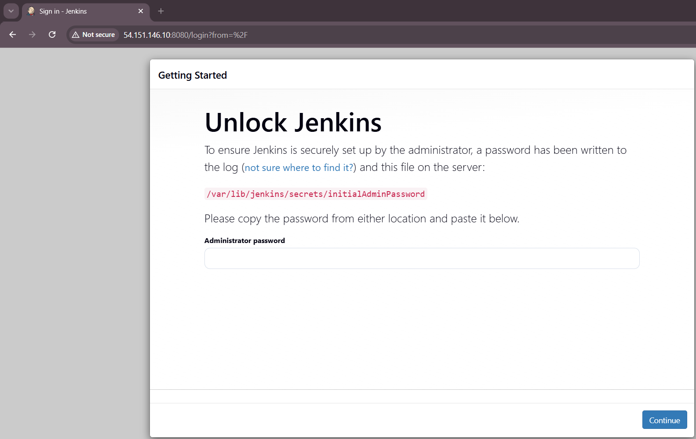

To Extract Initial Password Login to `Jenkins-Server` using `ubuntu` userid and generated pam file as authentication file and run below cmd given.

```bash
sudo -i
cat '/var/lib/jenkins/secrets/initialAdminPassword'
```

Paste the Initial Password and Click `Continue`

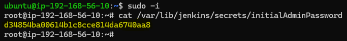

Click on `Install suggested plugins`

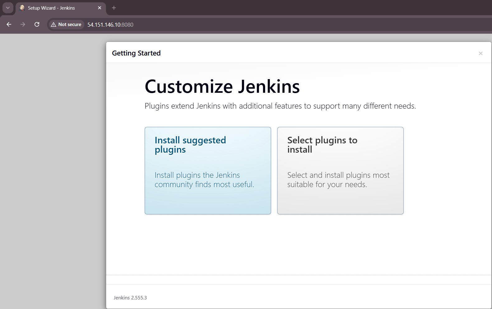

Jenkins Plugin Installation in Progress Page...

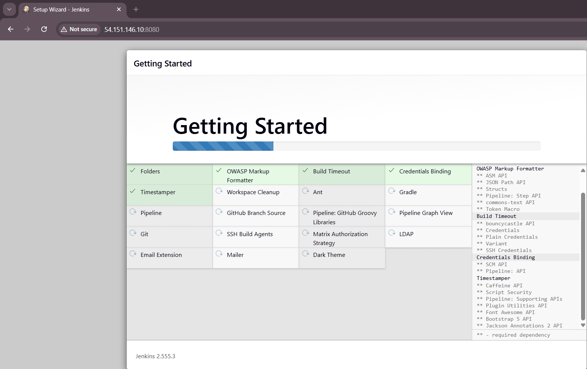

Create Admin User as Shown below

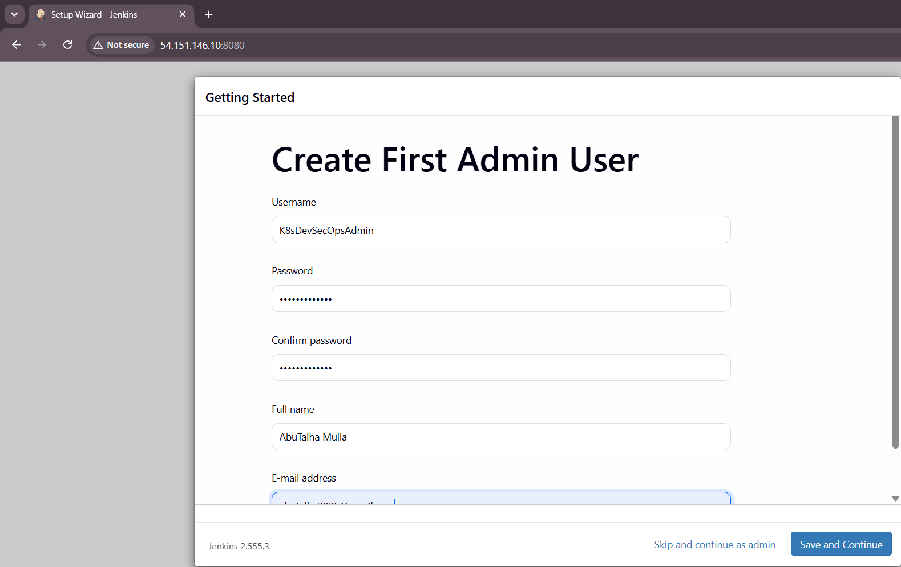

Click on `Save and Finish`

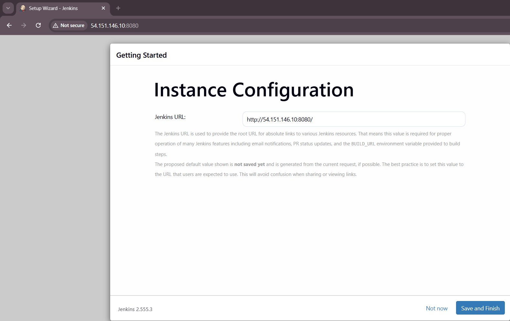

Click on `Start using Jenkins`

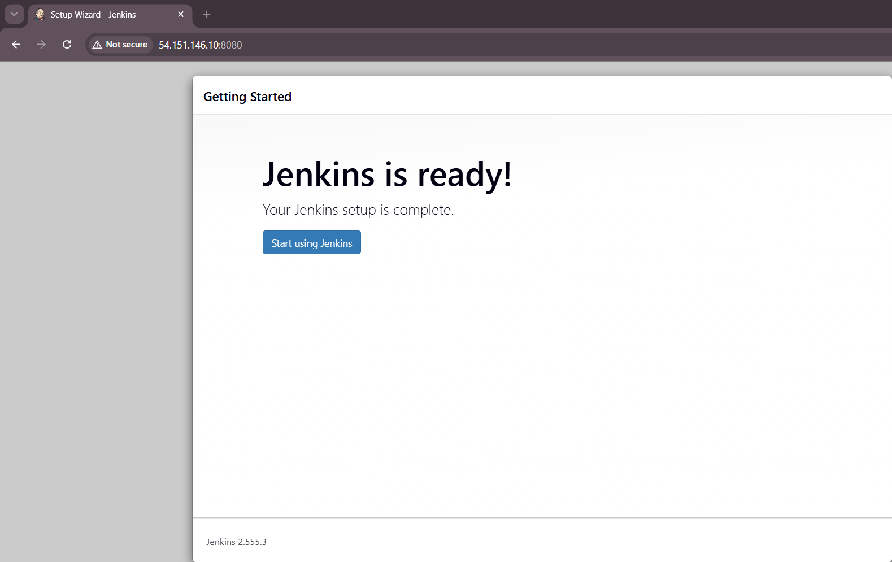

The Jenkins Dashboard will look like the snippet below

### Step 6: EKS Cluster Deployment

Use `eksctl` on your Jenkins server to spin up the Kubernetes cluster:
Now, go back to your `Jenkins-Server` terminal and configure the `AWSCLI`.

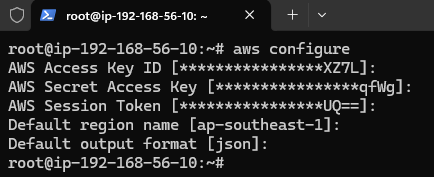

Go to `Manage Jenkins`

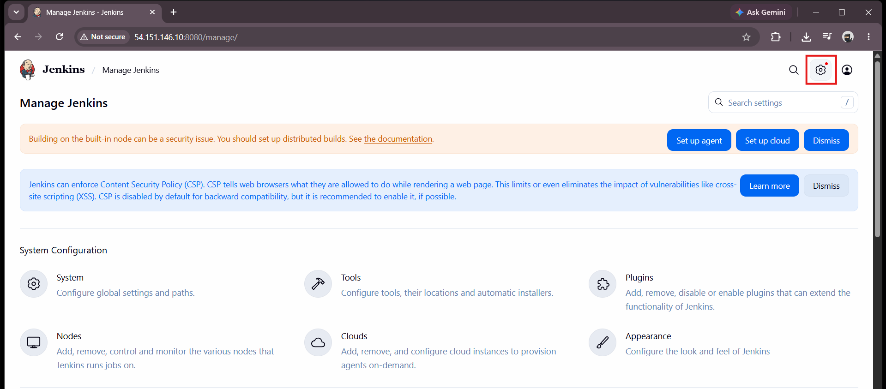

Click on `Plugins`


Select the `Available plugins`, install the following plugins and click on `Install`

```bash
AWS Credentials
Pipeline: AWS Steps
Pipeline: Stage View
Docker
Docker Commons
Docker Pipeline
Docker API
docker-build-step
Eclipse Temurin installer
NodeJS
OWASP Dependency-Check
SonarQube Scanner
```

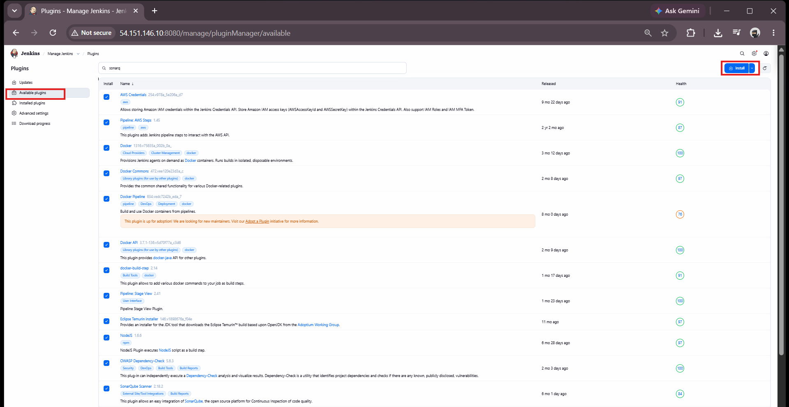

Once both plugins are installed, restart your Jenkins service by checking the Restart Jenkins option.

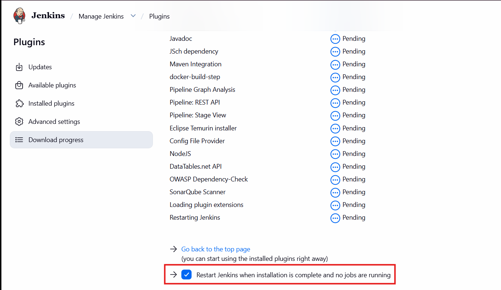

Log in to your Jenkins Server Again.

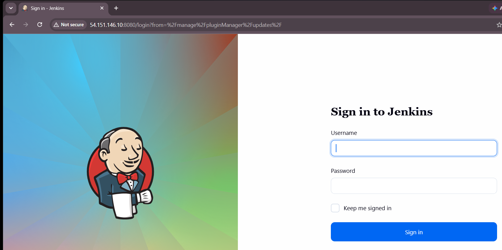

Now, we have to set our AWS credentials on Jenkins

Go to `Manage Plugins` and click on `Credentials`

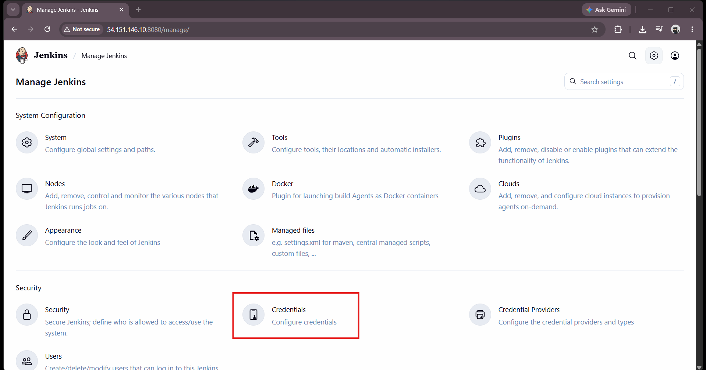

Click on `global`.

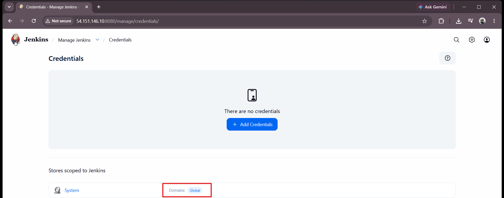

Click on `Add Credentials`

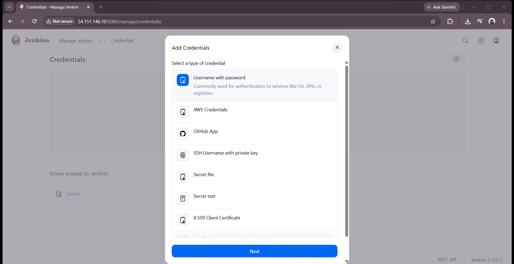

Select `Username with Password` and Click `Next`

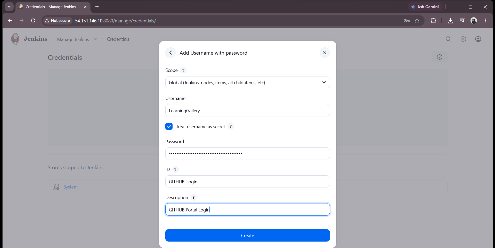

Click on `Create` and continue for rest Credentials as shown below

| Type | ID / Name | Value / Hint | Scope / Description |
| :--- | :--- | :--- | :--- |
| AWS Credentials | **AWS_ACCESS_ID_n_KEY** | Key in `Access ID` and `Secret` that you Generated in `Step 1.8` for `AWSLCI` | System - Global - AWS Credentials |
| Username with PPassword | **GITHUB_Login** | Key in your GITHUB Repository `Username` and `Personal Acess Token` Generated from `Developer setting` page  | System - Global - GITHUB Portal Login |
| Secret Text | **Sonar-Token** | | System - Global - Sonar-Token |
| Secret Text | **GITHUB-Token** | Key in your GITHUB `Personal Acess Token` Generated from `Developer setting` page | System - Global - GITHUB-Token |
| Secret Text | **AWS_ACCOUNT_ID** | Key in Your `AWS Account ID` | System - Global - AWS_ACCOUNT_ID |
| Secret Text | **ECR-Frontend** | | System - Global - ECR-Frontend |
| Secret Text | **ECR-Backend** | | System - Global - ECR-Backend |
| Secret Text | **NVD_API_KEY** | | System - Global - NVD DP Check Token |

Finally it should resemble like this.

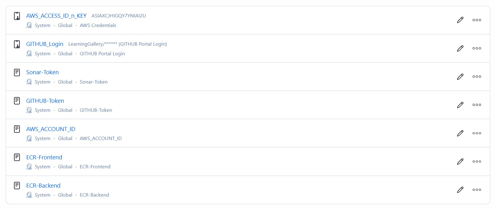

Create an eks cluster using the commands below.

```bash
eksctl create cluster --name 3Tier-K8s-EKS-Cluster --region ap-southeast-1 --node-type t2.medium --nodes-min 2 --nodes-max 2
aws eks update-kubeconfig --region ap-southeast-1 --name 3Tier-K8s-EKS-Cluster
```

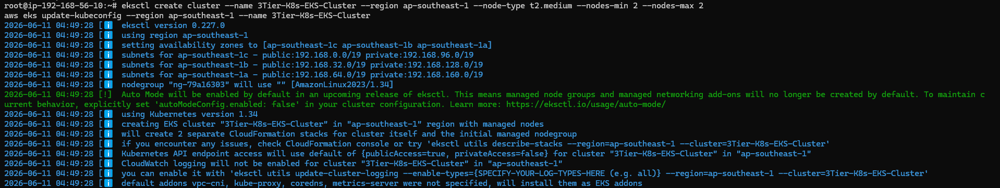

Once your cluster is created, you can validate whether your nodes are ready or not by using the following command

```bash 
kubectl get nodes
```

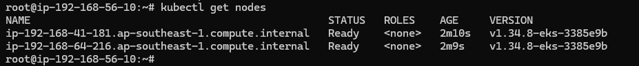

### Step 7: AWS App Load Balancer Ingress Controller Setup For EKS

1. Create an IAM policy and attach it to an OIDC provider.
Download the policy for the LoadBalancer prerequisite.

```bash
curl -O https://raw.githubusercontent.com/kubernetes-sigs/aws-load-balancer-controller/v2.5.4/docs/install/iam_policy.json
```

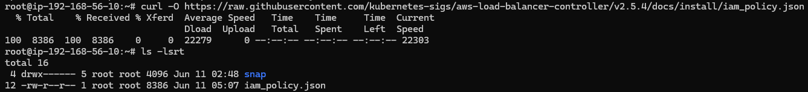

Create the IAM policy using the command below

```bash
aws iam create-policy --policy-name AWSLoadBalancerControllerIAMPolicy --policy-document file://iam_policy.json
```

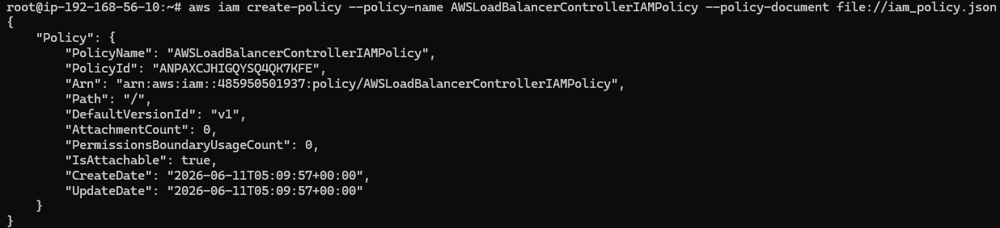

Create OIDC Provider

```bash
eksctl utils associate-iam-oidc-provider --region=ap-southeast-1 --cluster=3Tier-K8s-EKS-Cluster --approve
```

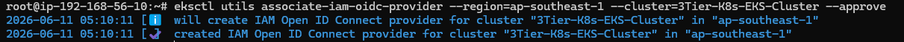

Create a Service Account by using the below command and replace your account ID with your one.

```bash
eksctl create iamserviceaccount --cluster=3Tier-K8s-EKS-Cluster --namespace=kube-system --name=aws-load-balancer-controller --role-name AmazonEKSLoadBalancerControllerRole --attach-policy-arn=arn:aws:iam::<your_account_id>:policy/AWSLoadBalancerControllerIAMPolicy --approve --region=ap-southeast-1
```

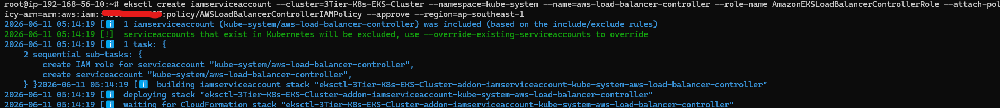

2. Deploy the AWS Application Load Balancer (ALB) Controller to your EKS cluster to handle ingress traffic automatically.
Run the below command to deploy the AWS Load Balancer Controller

```bash
sudo snap install helm --classic
helm repo add eks https://aws.github.io/eks-charts
helm repo update eks
helm install aws-load-balancer-controller eks/aws-load-balancer-controller -n kube-system --set clusterName=my-cluster --set serviceAccount.create=false --set serviceAccount.name=aws-load-balancer-controller
```

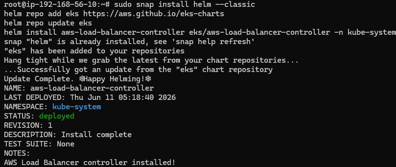
After 2 minutes, run the command below to check whether your pods are running or not.

```bash
kubectl get deployment -n kube-system aws-load-balancer-controller
```

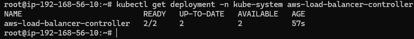

### Step 8: Amazon ECR Repositories

Create private Elastic Container Registry (ECR) repositories for your application images.

```bash
aws ecr create-repository --repository-name frontend --region ap-southeast-1
aws ecr create-repository --repository-name backend --region ap-southeast-1

```
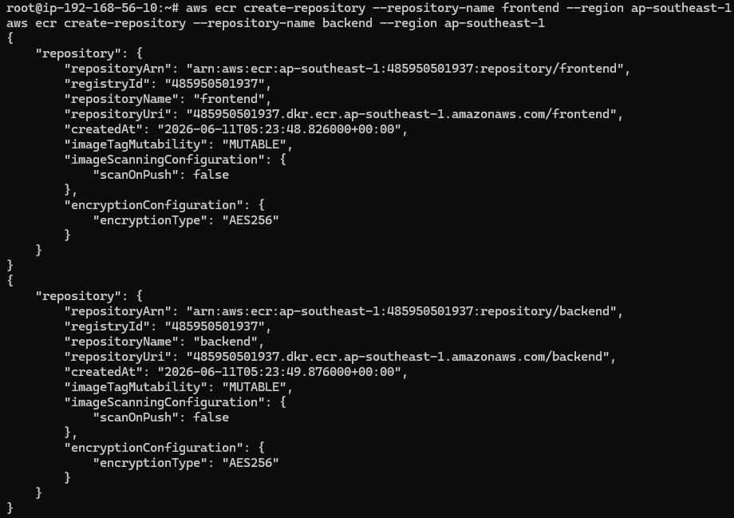

Now, we need to configure ECR locally because we have to upload our images to Amazon ECR.
Copy the 1st command for login as shown

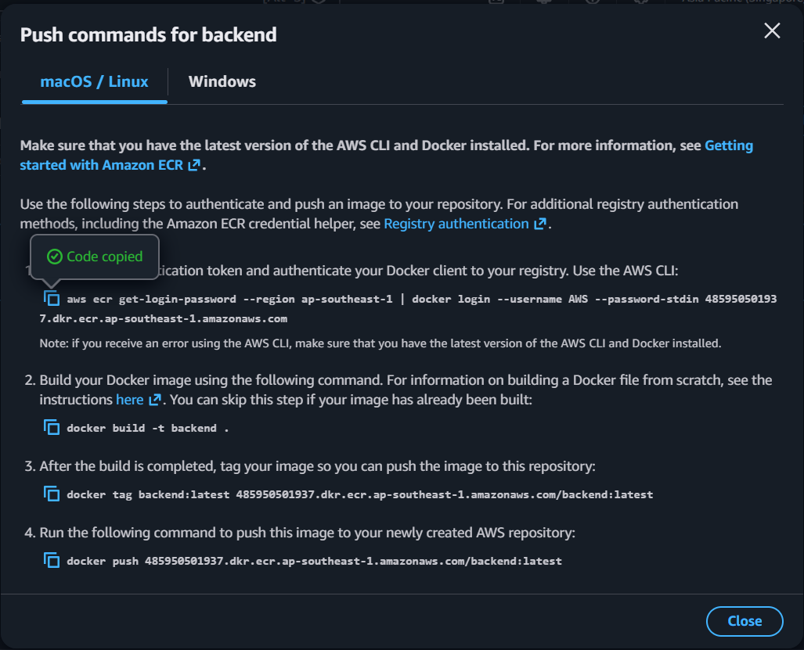

Now, run the copied command on your `Jenkins-Server`.

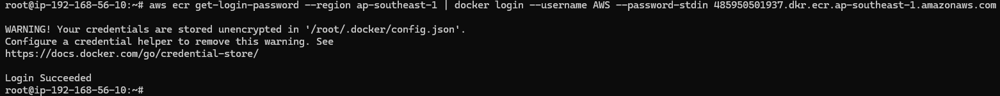

#### Step 9: Install & Configure ArgoCD

We will be deploying our application on a 3tier namespace. To do that, we will create a 3tier namespace on EKS

```bash
kubectl create namespace three-tier
```

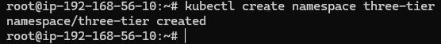

create a secret for our ECR Repo by the below command

```bash
kubectl create secret generic ecr-registry-secret \
  --from-file=.dockerconfigjson=${HOME}/.docker/config.json \
  --type=kubernetes.io/dockerconfigjson --namespace 3tier
kubectl get secrets -n 3tier
```

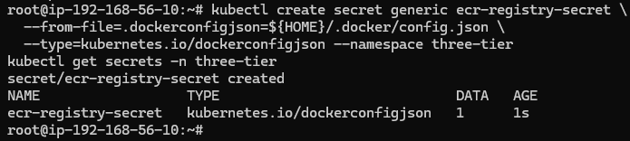

Now, we will install argoCD. To do that, create a separate namespace for it and apply the argocd configuration for installation.

```bash
kubectl create namespace argocd
kubectl apply -n argocd -f https://raw.githubusercontent.com/argoproj/argo-cd/v2.4.7/manifests/install.yaml
```

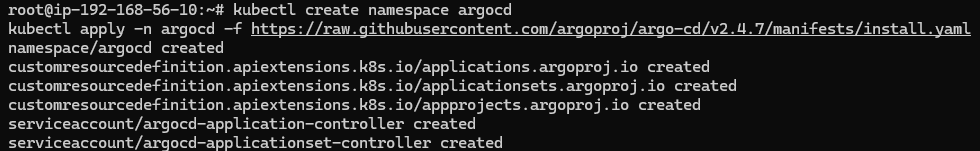

All pods must be running. To validate, run the command below

```bash
kubectl get pods -n argocd
```

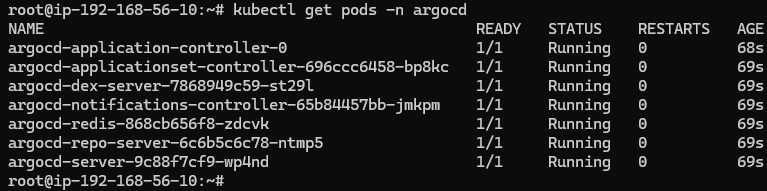

Now, expose the argoCD server as a LoadBalancer using the below command

```bash
kubectl patch svc argocd-server -n argocd -p '{"spec": {"type": "LoadBalancer"}}'
```

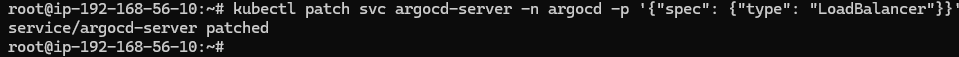

To access the argoCD, copy the LoadBalancer DNS and hit it on your favourite browser.

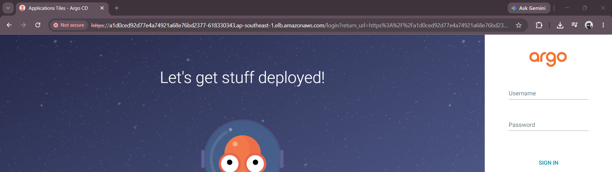

Now, we need to get the password for our argoCD server to perform the deployment.
To do that, we have a prerequisite, which is jq. Install it by the command below.

```bash
sudo apt install jq -y
export ARGOCD_SERVER=$(kubectl get svc argocd-server -n argocd -o json | jq -r '.status.loadBalancer.ingress[0].hostname')
export ARGO_PWD=$(kubectl -n argocd get secret argocd-initial-admin-secret -o jsonpath="{.data.password}" | base64 -d)
echo %ARGO_PWD
```

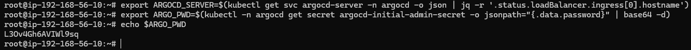

Here is our ArgoCD Dashboard.

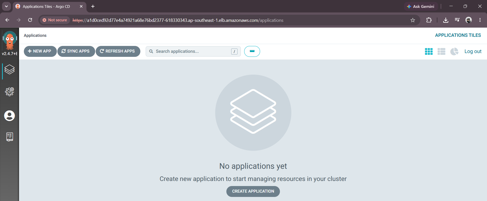

#### Step 10: Configure Security & Code Quality (SonarQube & Trivy)

1. Access SonarQube via `http://<EC2-PUBLIC-IP>:9000`.
Default Username and Password will be admin 
Click on Log In

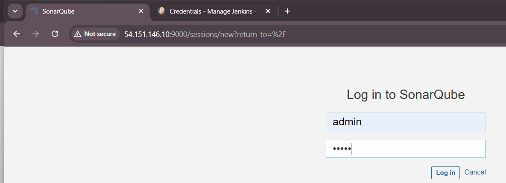

On the next Page will ask to `Update your Password` just change as per your choice.

2. Generate a Security Token and Webhook.

Click on `Administration`, then `Security`, select `Users` and Click on `Update token`

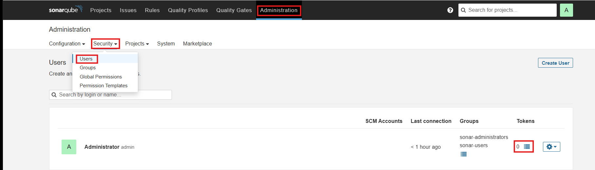

Click on `Generate` and Copy the `token`, keep it somewhere safe and click on `Done`.

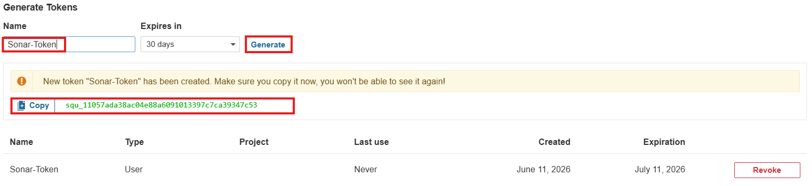

Now, We have to configure webhooks for quality checks. Click on `Administration`, then `Configuration`, and select `Webhooks`

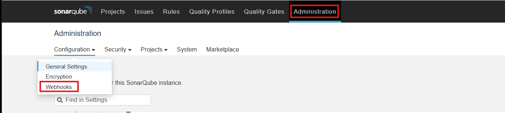

Click on `Create` and Provide the name of your project and in the URL, provide the Jenkins server public IP with port 8080, add sonarqube-webhook in the suffix, and click on `Create`.
`http://<jenkins-server-public-ip>:8080/sonarqube-webhook/`

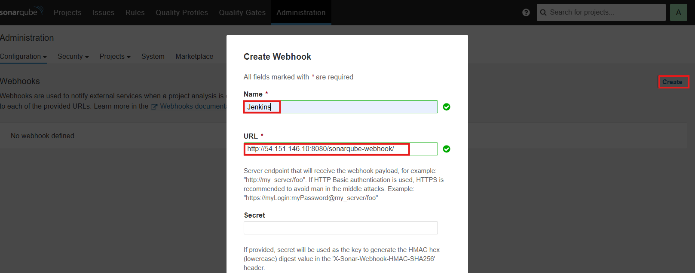

Now, we have to create a Project for the `frontend` code. Click on `Manually`.

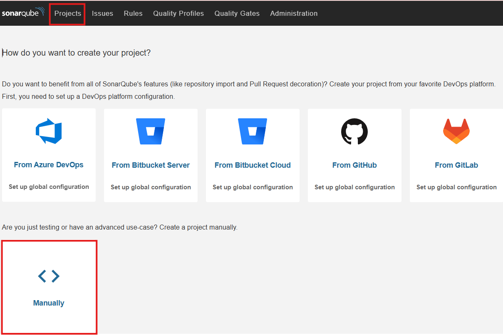

Provide the display name `3Tier-Frontend` to your Project and click on `Setup`

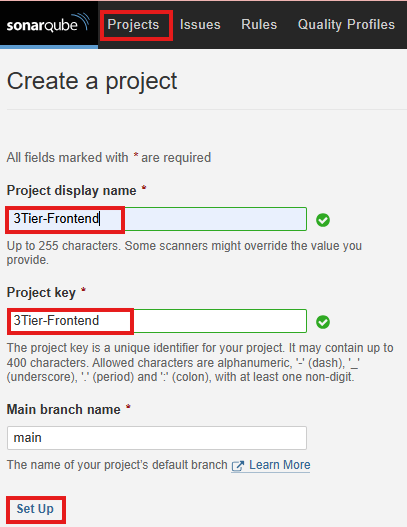

Select the `Use existing token` and click on `Continue`.

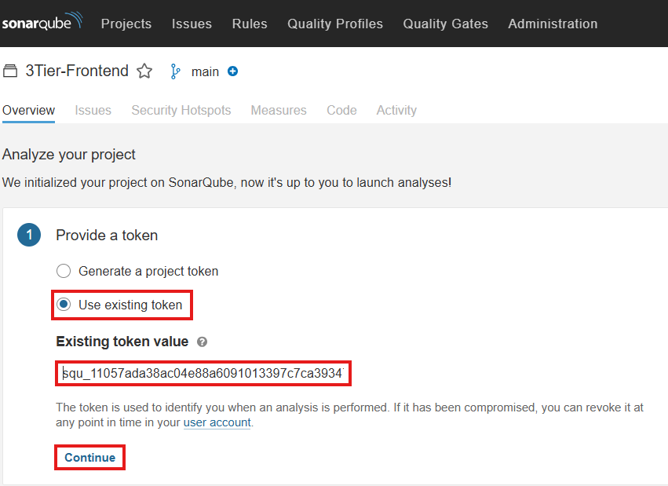

Select `Other` and `Linux` as OS.

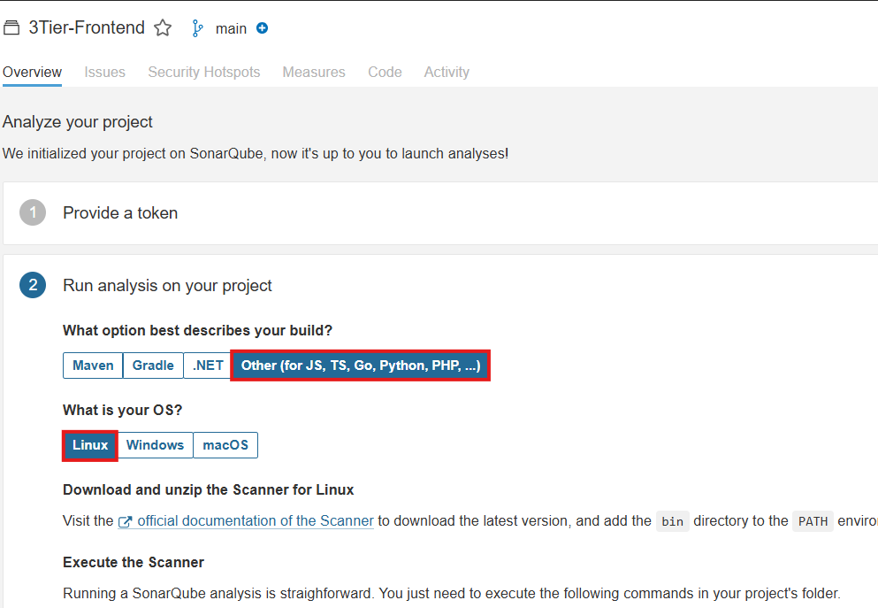

Now, we have to create a Project for the Frontend code do the same for Backend Code.

#### Step 11: Configure Jenkins Tools

1. Go to `Dashboard` -> `Manage Jenkins` -> `Tools`

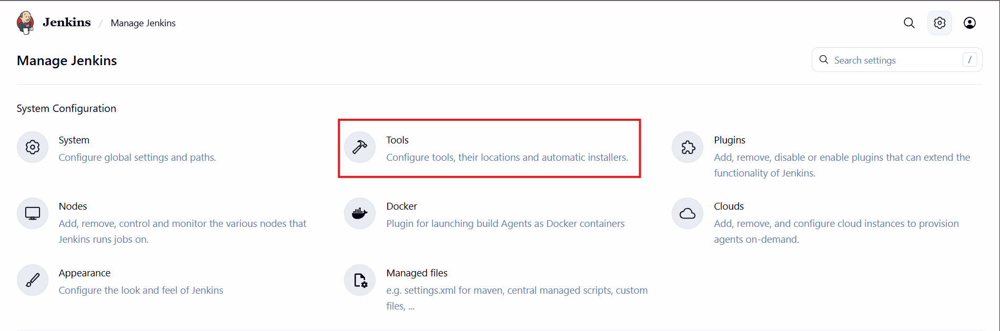

2. We are configuring `JDK`, Search for JDK and provide the configuration like the snippet below.

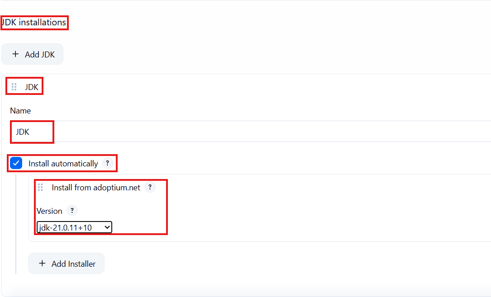

3. Now, we will configure the `SonarQube scanner`

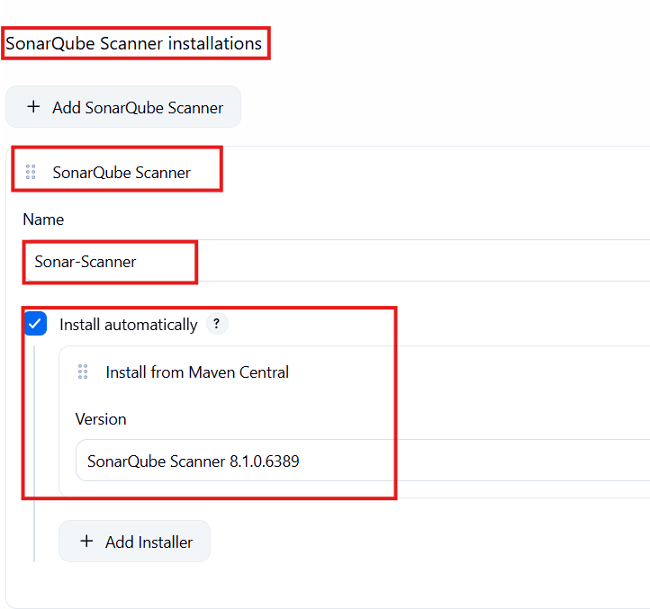

4. Proceed with `NodeJS` Tools Configuration.

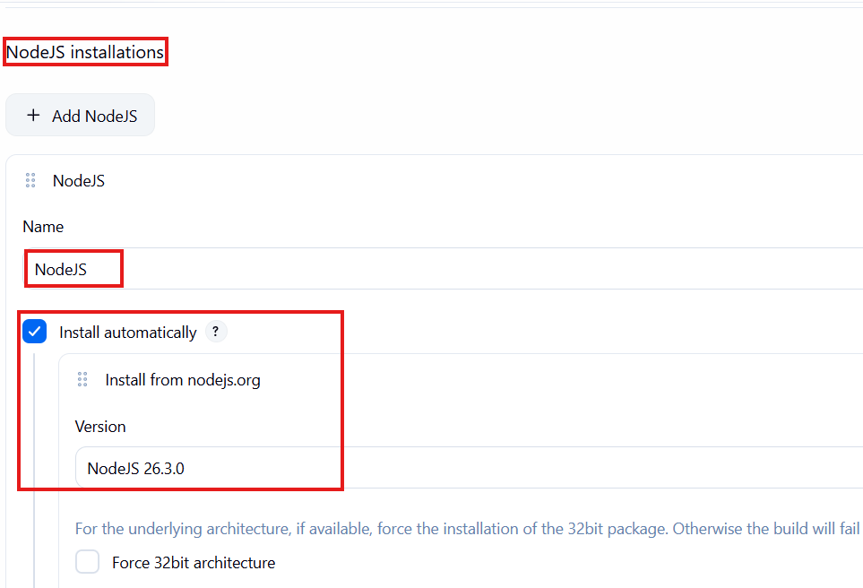

5. Configure OWASP `Dependency Check`

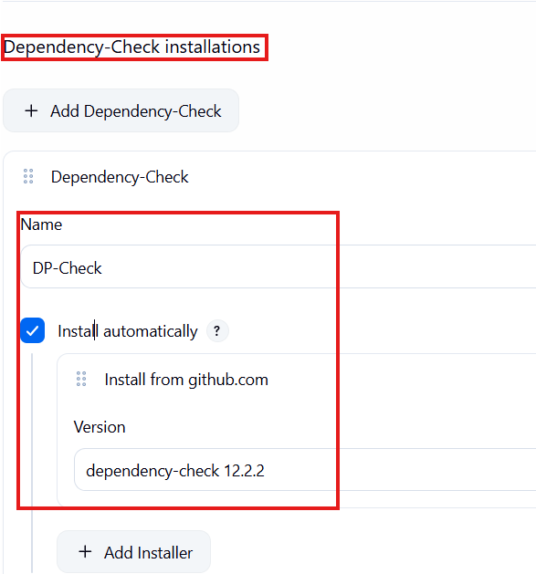

6. Finally Configure Docker Jenkins Tool


#### Configure Jenkins System for Tools Path.

Go to `Dashboard` -> `Manage Jenkins` -> `System` -> Search for `SonarQube installations`
Provide the name as it is, then in the Server URL, copy the SonarQube public IP (same as Jenkins) with port 9000, select the Sonar token that we have added recently, and click on Apply & Save.


Now, we are ready to create our Jenkins Pipeline to deploy our Frontend and Backend Code.

### Step 12: Jenkins CI Pipelines

Set up pipelines in Jenkins to completely automate the following tasks:

* Code checkout
* SonarQube Analysis & Quality Gate check
* Docker Build
* Trivy File & Image Scanning
* Push Docker Image to ECR
* Update Kubernetes manifests with the new image tag.

Go to Jenkins `Dashboard` Click on `New Item`


Provide the name of your Pipeline `3Tier-Backend-Application` Select `Pipeline` and click on `OK`.


On Pipeline Config Page Select `Pipeline` and on the Pipeline Definition Section Select from dropdown `Pipeline script from SCM` -> Repository URL: `https://github.com/LearningGallery/End-to-End-k8s-3-Tier-DevSecOps-Project.git` -> Credentials: `GITHUB Portal Login`.


Under Braches and Build key in `*./main` -> Script Path: `Jenkins-Pipeline-Code/Jenkinsfile-Backend` -> `Apply` and `Save`.


### Step 9: ArgoCD Installation (GitOps)

Install ArgoCD onto your EKS cluster:

```bash
kubectl create namespace argocd
kubectl apply -n argocd -f [https://raw.githubusercontent.com/argoproj/argo-cd/stable/manifests/install.yaml](https://raw.githubusercontent.com/argoproj/argo-cd/stable/manifests/install.yaml)

```

Expose ArgoCD via LoadBalancer, retrieve the admin password, and connect your repository to sync application deployment manifests.

### Step 10: Deploy the Three-Tier Application

Using ArgoCD, deploy the application components:

* **Database Layer:** Persistent Volumes (PV), Claims (PVC), and MongoDB deployment.
* **Backend Layer:** NodeJS API deployments and services.
* **Frontend Layer:** ReactJS user interface and ingress configurations mapping to your domain.

### Step 11: Monitoring (Prometheus & Grafana)

Deploy the Kube-Prometheus stack via Helm:

```bash
helm repo add prometheus-community [https://prometheus-community.github.io/helm-charts](https://prometheus-community.github.io/helm-charts)
helm repo update
helm install prometheus prometheus-community/kube-prometheus-stack --namespace monitoring --create-namespace

```

Access Grafana using Port-Forwarding or LoadBalancer to build customized dashboards tracking pod health, CPU/memory usage, and application metrics.

---

## 🧹 Clean Up

To avoid unexpected AWS charges, destroy all resources when the project is finished.

```bash
# Delete ArgoCD Applications
kubectl delete -f application.yaml

# Delete EKS Cluster
eksctl delete cluster --name three-tier-cluster --region us-east-1

# Destroy EC2 Infrastructure via Terraform
cd terraform
terraform destroy --auto-approve

```

## 🤝 Contributing

Contributions, issues, and feature requests are welcome! Feel free to check the [issues page](https://www.google.com/search?q=../../issues).

## 📄 License

This project is [MIT](https://www.google.com/search?q=LICENSE) licensed.